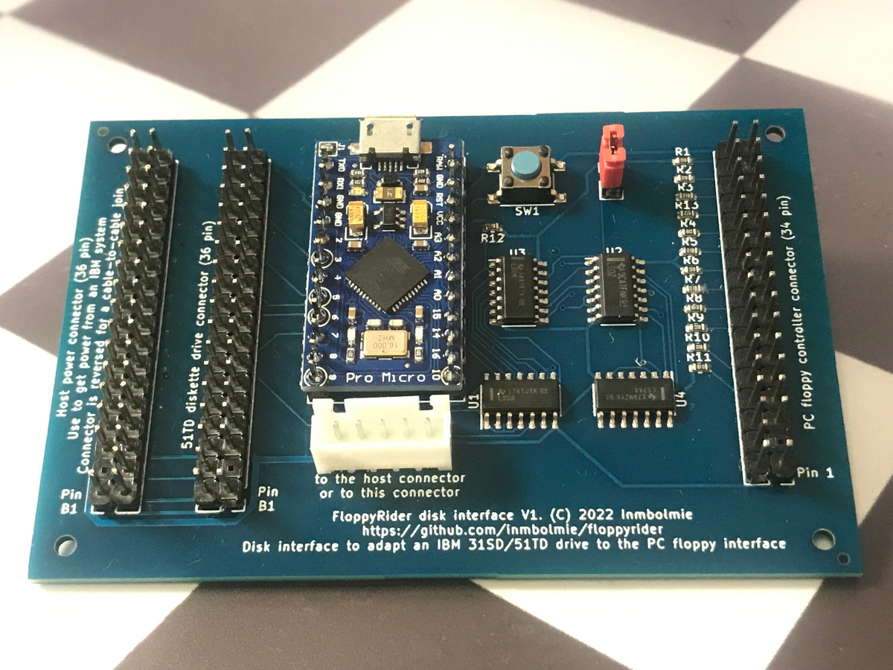
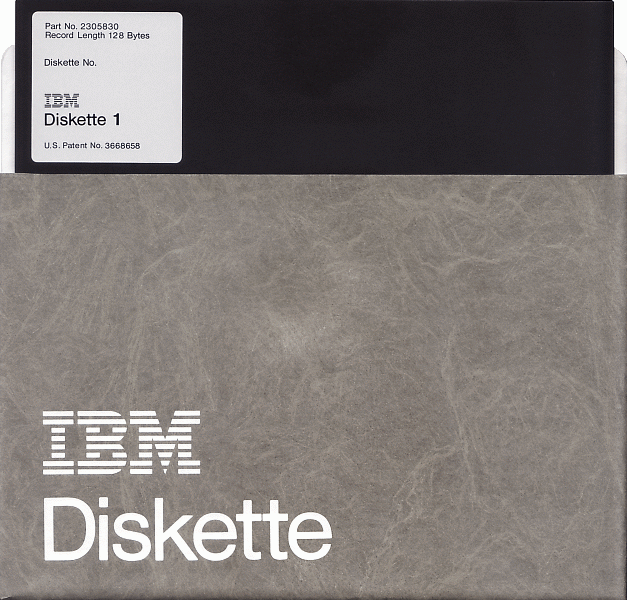
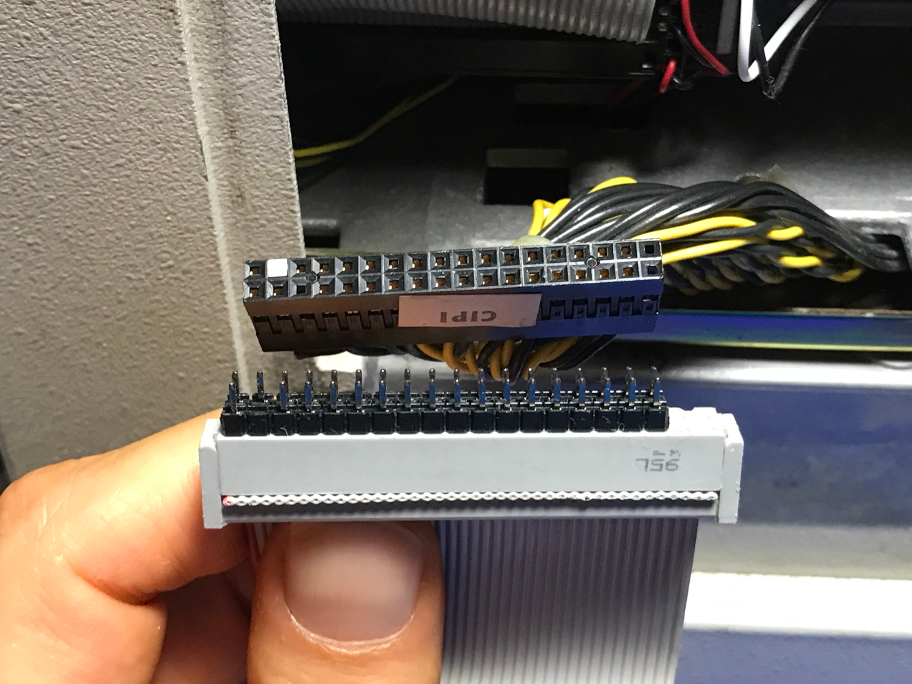
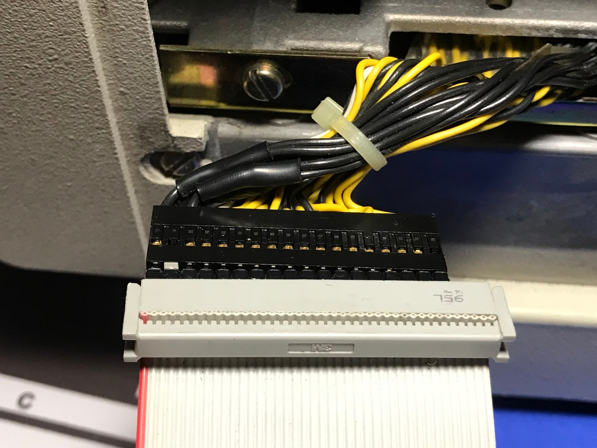
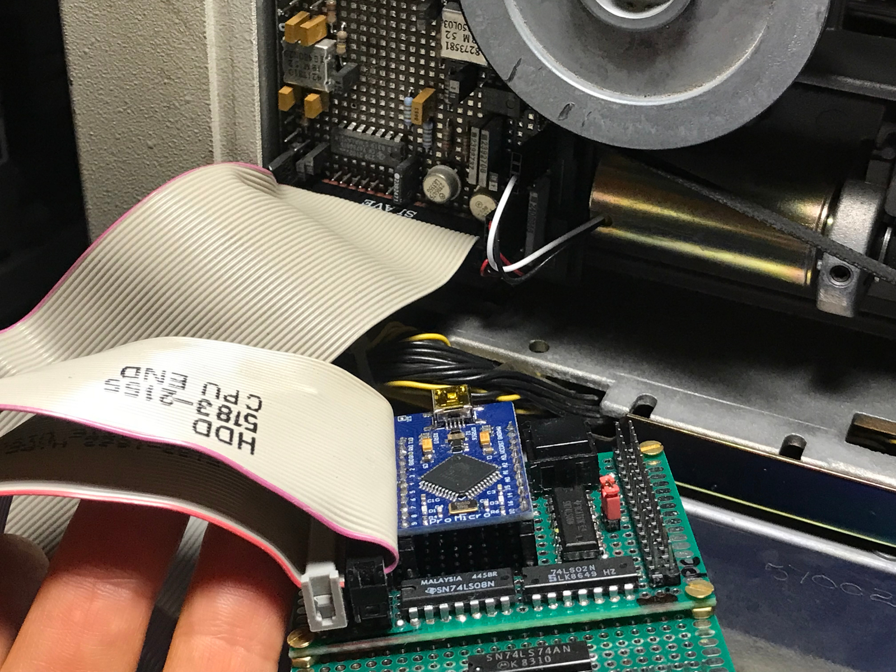
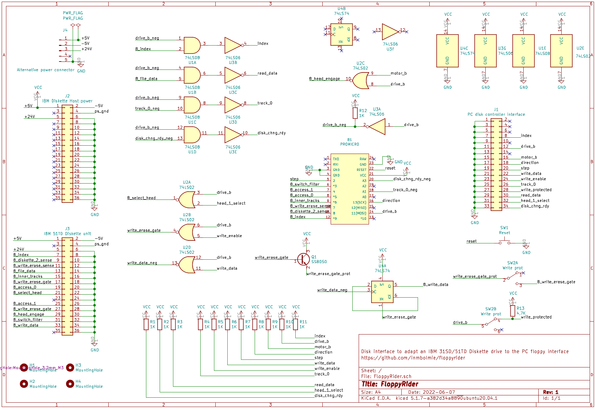
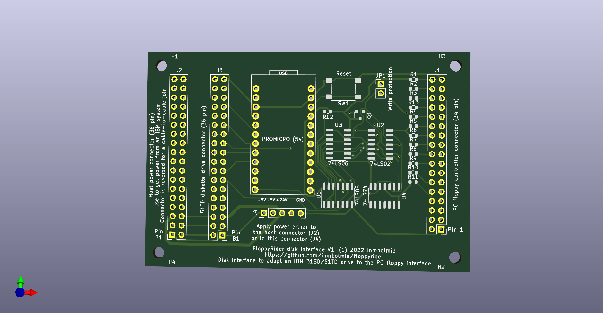

# FloppyRider
Disk interface adapter to connect an IBM 31SD or 51TD 8-inch disk unit to a standard PC floppy controller

__This project is currently in Beta stage.__

__Second revision (20220624): I have added a transistor to drive the write/erase-gate signals on the IBM drive. I have noticed that write/erase-gate have a very low input impedance (90 ohms each, could that be a safety measure to make harder to accidentally drive the signal high?) that is way over-spec for the 74LS logic to drive properly. The prototype worked by pure luck but trying with other 74LS components the signal level was too low to enable the gates so the device was only capable of reading. The solution is to include a transistor to drive that signals up to aceptable levels.__

## Introduction

This is an ongoing project to create an adapter to be able to use IBM 8-inch Diskette drives with a standard PC floppy controller.

I currently have a working prototype capable of reading, writing and formatting Diskette 1 and 2 types on a 51TD disk drive. Further testing will be needed to consider it stable and fully operational.

This project was inspired by CuriousMarc's video about data recovery from 8-inch floppies. This kind of converter is something Master Ken would have made like in five minutes using a Teensy, in case they wanted to use a genuine IBM Diskette drive in their data recovery adventure.

[Fossil Data Part 2: 8-Inch IBM Floppy Data Recovery](https://www.youtube.com/watch?v=5FVwheTVWko)

## Hardware

The adapter hardware is pretty straightforward and can be made cheapily with very low-cost components:

* Pin headers and IDC ribbon cables
* Arduino ProMicro microcontroller board (5V)
* 74LS02
* 74LS06
* 74LS08
* 74LS74
* 12x1K resistors
* 1x4,7K resistor
* NPN transistor

## Software

You can get the Arduino source code for the ProMicro in the __FloppyRider__ directory. You can program it using the regular Arduino IDE.

## KiCad Project

You can get the current project files in the __KiCad__ directory. The PCB design has not been validated at this point.

## Operation

These are the main points that need to be carried out for conversion:

#### Logic levels

The PC floppy signals are open collector low-level active, while the IBM signals are push-pull high-active. The 74 series chips provide most of the conversion.

All the signals are gated by the "drive select" PC signal for the adapter to be able to operate with another floppy drive on the same cable.

#### Track addressing

The PC floppy adresses tracks by a "direction" and "step" signal, and gets a "track 0" signal when the head is placed at such track. The IBM interface lacks a "track 0" signal and you control direcly the stepper motor signals "access 0" and "access 1". The ProMicro initializes the head position at track 0 at startup. From there it gets track of where the head is actually positioned and translates the required signals on both sides.

#### Write data signal.

The PC floppy write data signal generates a full pulse (falling and rising edge) for each magnetic flux transition that needs to be recorded on the disk surface, while in the IBM interface the "write data" signal records a magnetic flux transition for each signal level change (rising or falling edge). The conversion is made via the 74LS74 flip-flop.

## Connection

The 31SD and 51TD disk drives have pretty hefty power requirements, as you will need to provide them with:

* AC mains power for the disk rotating motor (on a separate connector)
* +24V at 12W (on the 36-pin idc connector)
* +5V (on the 36-pin idc connector)
* -5V (on the 36-pin idc connector)

The easier way to get all the required power rails is getting them from the original host hardware where the disk drive is enclosed. For that reason a 36-pin host connector header is provided. Note that the connector sides are mirrored to be able to use it with a cable-to-cable connection. The adapter will be placed as a bridge between the host cable and the disk drive header.

If you have a separated power supply capable of providing the required DC levels you can leave the host header unconnected and provide power via a separate connector. That way something like a separated disk enclosure could be made.

The other 36-pin header will be used with a regular IDC ribbon cable connector to connect it to the disk drive. Note that you won't be _easily_ able to use the most common 40-pin cables as the available space for the connector in the disk drive is very limited.

_As the connectors carry a powerful +24V signal, connector orientation is critical and getting it wrong, reversing or misplacing it could damage your hardware._

On the other end of the adapter you have a 34-pin header for the PC standard floppy cable. The adapter is hard-wired for drive B as most PC floppy drives are.

## Schematics

As currently working on the prototype unit. Subject to further modification

## PCB

Sample of how the actual PCB could be. Not validated in production examples.

