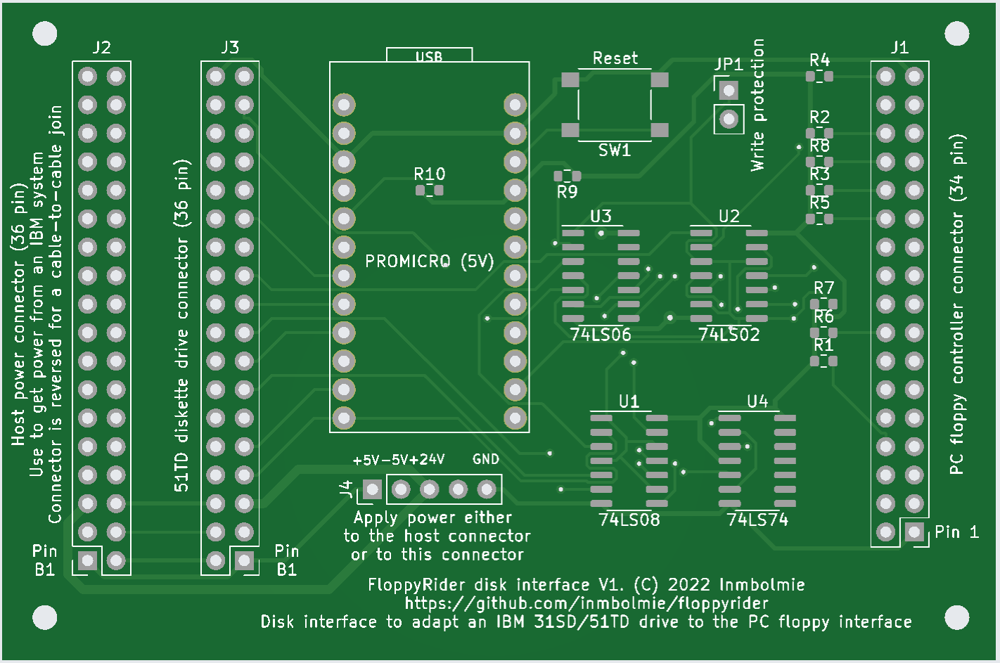

# FloppyRider
Disk interface adapter to connect an IBM 31SD or 51TD 8-inch disk unit to a standard PC floppy controller

__This project is currently in Beta stage.__

## Introduction

This is an ongoing project to create an adapter to be able to use IBM 8-inch Diskette drives with a standard PC floppy controller. I currently have a working prototype capable of reading and writing to Diskette 1, 2 and 2D types on a 51TD disk drive. Further testing will be needed to consider it fully operational.

This project was inspired by CuriousMarc's video about data recovery from 8-inch floppies. This kind of converter is something Master Ken would have made like in five minutes using a Teensy, in case they wanted to use a genuine IBM Diskette drive in their data recovery adventure.

[Fossil Data Part 2: 8-Inch IBM Floppy Data Recovery](https://www.youtube.com/watch?v=5FVwheTVWko)

## Hardware

The adapter hardware is pretty straightforward and can be made cheapily with very low-cost components:

* Pin headers
* Arduino Pro-Micro microcontroller board (5V)
* 74LS02
* 74LS06
* 74LS08
* 74LS74
* 5x1K resistors
* 5x4,7K resistors

## Schematics

Subject to further modification

## PCB

Sample of how the actual PCB could be

